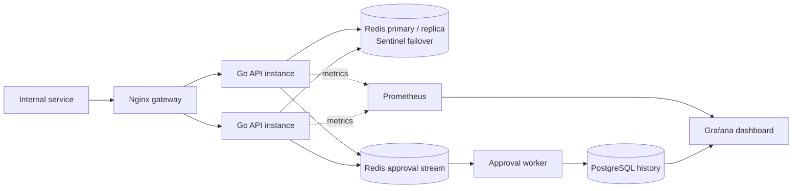

<div align="center">

# Global Rate Limiter

### One shared quota. Decisions backed by evidence.

An educational, production-shaped Go service that explores how to enforce client and provider quotas across API instances—one demonstrated limitation at a time.

[](https://go.dev/)
[](https://redis.io/)
[](https://www.postgresql.org/)
[](https://prometheus.io/)
[](https://grafana.com/)
[](https://docs.docker.com/compose/)

</div>

## The problem

If each API instance keeps its own rate-limit counter, each instance can spend the full quota. Two instances can approve twice what an external provider allows. A shared counter solves that correctness problem, but then the counter store becomes part of the decision path: what happens when it is slow, unavailable, or fails over?

This project works through those questions as an engineering story. It starts with a small in-memory limiter, measures where that design breaks, and introduces shared state, failover, event history, reporting, and observability only when earlier experiments justify them.

## What the service does

- Evaluates a weighted request against a policy selected by `(client_id, resource)`.
- Enforces one token-bucket quota across multiple API instances using an atomic Redis operation.
- Fails closed within a bounded deadline when authoritative rate-limit state is unavailable.
- Records approvals to a Redis Stream and persists them asynchronously to PostgreSQL.
- Reports approved usage over 10, 15, or 30 days.
- Exposes bounded Prometheus metrics and a provisioned Grafana dashboard with tested alert rules.

The current demo policies are `client-a/openai` at 100 tokens per minute and `client-b/stripe` at 5,000 tokens per minute. Policies are static in application configuration.

## Design in one view



The synchronous decision uses Redis. PostgreSQL is downstream of an approval-event worker, so historical reporting does not add a database query to every rate-limit decision. Prometheus and Grafana observe the system outside that decision path.

## The design journey

The repository has 18 checkpoints, from V0's API contract through V17's dashboard and alert evaluation. Each phase records what failed, what options were considered, why one was chosen, and what limitation remains. Read the [full design journey](docs/design-journey.md) for the complete reasoning.

| Checkpoint | What the evidence taught us |
|---|---|
| **V0–V2 · Contract and concurrency** | Define a storage-independent decision contract, then prove that an unsynchronized in-memory map can fail under concurrent requests and protect the complete state change with a mutex. |
| **V3–V6 · Algorithm choices** | A fixed window can approve six requests around a three-request boundary. A sliding log fixes the burst but retains one record per approval. A token bucket gives continuous refill with bounded state. |
| **V7 · Distribution evidence** | Measure capacity, availability, and quota correctness separately. The local single-process run established a repeatable 2,000 RPS floor; two in-memory instances each approved their full quota, demonstrating quota multiplication. The same-host test did not establish that replication increases capacity. |
| **V8–V11 · Shared state and failure** | Move decisions to Redis and make refill/check/spend atomic. Sentinel handles a single Redis-node failure; AOF preserves state across process replacement. Timeouts, a circuit breaker, fail-closed HTTP 503 responses, and readiness bound complete Redis outages. |
| **V12–V14 · Approval history under pressure** | Append an event atomically with each approval, persist it asynchronously with idempotent PostgreSQL writes, and cap the Redis backlog so a prolonged worker outage cannot grow without bound. |
| **V15 · Historical usage** | Query durable approved usage and daily weighted-cost trends without making PostgreSQL part of quota enforcement. |
| **V16–V17 · Operations** | Export bounded decision metrics, visualize live and historical data in Grafana, and test alert thresholds. Removing one API instance fires an alert while the remaining instance continues serving. |

### Evidence, with its limits

- **Algorithm state:** the benchmark compares a constant-sized fixed-window entry with sliding-log allocations that grow with active approvals. See [benchmark method and results](docs/benchmarks.md).
- **Local capacity:** one API process passed all selected criteria at 2,000 requests per second in three trials. This is a local floor, not a production maximum. See [the capacity experiment](docs/load-testing.md).
- **Horizontal capacity:** the later Redis-backed comparison on one shared laptop did not pass its latency gate at 1,000 RPS. It does not support a throughput scaling claim; production comparison needs independent hosts and a separate load generator.
- **Availability:** the two-instance gateway continued serving when one API instance was stopped, and Prometheus fired the instance-down alert.
- **Global correctness:** independent in-memory instances multiplied the quota; Redis-backed instances share one atomic bucket.
- **Failure policy:** complete Redis loss returns bounded 503 responses without local fallback quota. Sentinel improves single-node recovery; a whole-host failure is outside the local topology's guarantee.
- **History:** PostgreSQL holds approved requests. Rejected requests and HTTP response latency are not presented as billing history.

These are reproducible experiments on a learning setup, not a claim that this Compose deployment is production-ready. The [requirements history](docs/requirements.md) captures the acceptance criteria and explicit limits phase by phase.

## Run it locally

Requirements: Docker with the Compose plugin. From the repository root:

```sh
docker compose up -d --build
```

The stack starts two API instances, Nginx gateways, Redis primary/replica with three Sentinels, an approval worker, PostgreSQL, Prometheus, Grafana, and Redis Commander. Check service state and the distributed API:

```sh
docker compose ps
curl http://localhost:8084/v1/health
```

Try a rate-limit decision:

```sh
curl -i -X POST http://localhost:8084/v1/check \
  -H "Content-Type: application/json" \
  -d '{"client_id":"client-a","resource":"openai","cost":1}'
```

An allowed decision returns `200`; an exhausted quota returns `429`. In both cases the response explains the limit and remaining capacity. Invalid requests return `400`, unknown policies return `404`, and unavailable decision dependencies return bounded `503` responses. See the [HTTP contract](docs/api.md) for response schemas and analytics routes.

| Local URL | What it shows |
|---|---|
| `http://localhost:8083` | One API instance through the comparison gateway |
| `http://localhost:8084` | Both API instances through the distributed gateway |
| `http://localhost:8085/v1/health` | Approval worker liveness |
| `http://localhost:8085/v1/readiness` | Approval worker dependency readiness |
| `http://localhost:8085/v1/status` | Approval backlog status |
| `http://localhost:5433` | PostgreSQL host port |
| `http://localhost:8082` | Redis Commander |
| `http://localhost:9090` | Prometheus and alert evaluation |
| `http://localhost:3000` | Grafana dashboard |

Grafana allows anonymous Viewer access in the local learning stack. Defaults are for local use; configure credentials through `.env` before exposing any service beyond your machine. Start with [dashboard and alerting](docs/dashboard-and-alerting.md) for the V17 rationale and limits.

Stop the stack with:

```sh
docker compose down
```

Named database and Redis volumes remain. Removing them requires an explicit `docker compose down -v` and deletes local persisted data.

## Test and inspect

The Go code targets Go 1.26. Run the application tests and static checks from the repository root:

```sh
go test ./... -count=1
go test -race ./...
go vet ./...
go build ./...
```

The race detector needs a C compiler. The shared-Redis integration test runs when Redis is reachable at `REDIS_TEST_ADDR` or `localhost:6379`; otherwise that integration test skips. To compare limiter state growth:

```sh
go test -run '^$' -bench=BenchmarkLimiterState -benchmem -benchtime=20x ./benchmarks
```

To repeat the HTTP capacity comparison, install Vegeta and follow the [cross-platform load-test guide](docs/running-load-tests.md). Prometheus alert expressions have deterministic `promtool` tests in `deploy/prometheus/alerts_test.yml`.

## Repository map

```text
cmd/api/                 API composition, HTTP routes, handlers, and lifecycle
cmd/worker/              Approval consumer process and lifecycle
internal/ratelimiter/    Limiter contract and isolated algorithms
internal/store/          Redis and PostgreSQL client construction
internal/events/         Approval persistence and stream cleanup workflow
internal/database/       sqlc-generated PostgreSQL access
sql/schema/              Goose migrations
sql/queries/             Source queries for sqlc
deploy/                  Compose support for Redis, Nginx, Prometheus, and Grafana
benchmarks/              Algorithm benchmark and Vegeta request inputs
docs/                    API contract, design journey, experiments, and operational guides
```

## What this project is—and is not

This is a portfolio and system-design teaching project. It aims to make the tradeoffs visible in code and measurable in experiments. Its current topology runs on one computer: Redis replication is asynchronous, AOF `everysec` has a small write-loss window, and the monitoring stack shares the application's host. It has no external alert delivery or multi-host failure isolation. Those limits are documented rather than hidden behind a production claim.

The next repository milestone is a release pass: consolidate the phase history, run final end-to-end checks, and prepare the architecture diagram and source archive.
